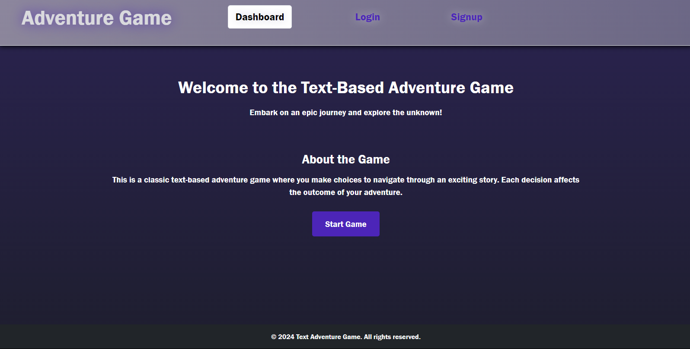
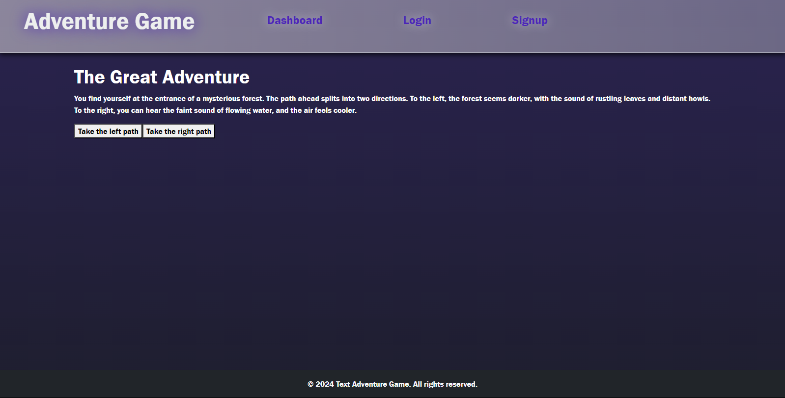
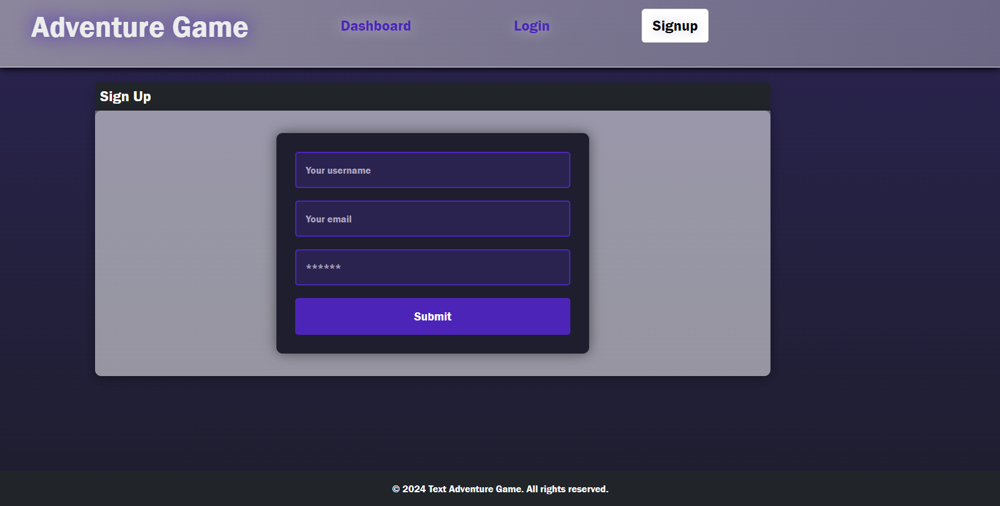
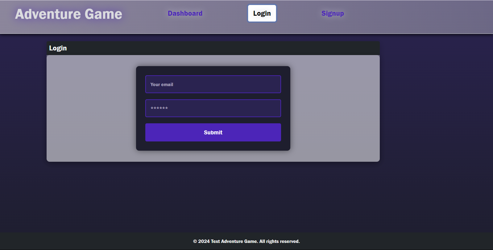

# Text Based Adventure Game

  
Link to site: 

## Description
A MERN stack single-page application allowing users to signup and login to save user progress. On the dashboard, a quick description of the game
is provided and a button to start the game. For each prompt of the game, users are given two choices to take action that leads the user down a path
until an end result is met.

## Table of Content
-[Description](#Description)
-[Process](#Process)
-[Installation](#Installation)
-[Usage](#Usage)
-[Licenses](#Licenses)
-[Contribution](#Contribution)
-[Test](#Test)
-[Acknowledgement](#Acknowledgement)

## Process
The process included copying over a basic MERN stack activity from the Vanderbilt bootcamp to start. The user model was modified to fit our application including a username, email, and password. Main.jsx and App.jsx was edited to feature four pages: Dashboard, Login, Signup, and the Game page which are all accessed from the header. The Dashboard features a 'start game' button that once pressed starts up the game. Front-end and back-end files were updated to fit our game including the queries, mutations, typeDefs, and resolvers. The seeds for the game was implemeneted and the UI features Bootstrap styling.

## Installation
To install this application, copy the ssh key from my github repo and clone it into your respository. Do an npm install then run these commands: npm run seed, npm run start.

## Usage
A fun game purely for an enjoyable experience! When clicking start game, you have the choice between two actions per prompt.

## Licenses
This repository is using the [MIT](https://opensource.org/licenses/MIT) license.

## Contribution
Contributors include Jeremy Fleming, Logan New, Sean Crocker, David Waweru, and Mackenzie Moore

## Test
To test this application, simply open the applcation in VScode to try it out.

## Acknowledgement
Project was done by the knowledge learned from the Vanderbilt bootcamp.