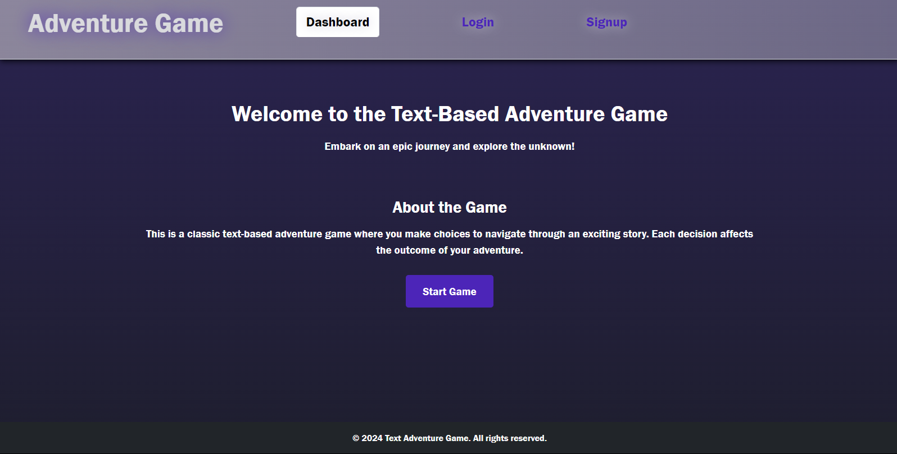
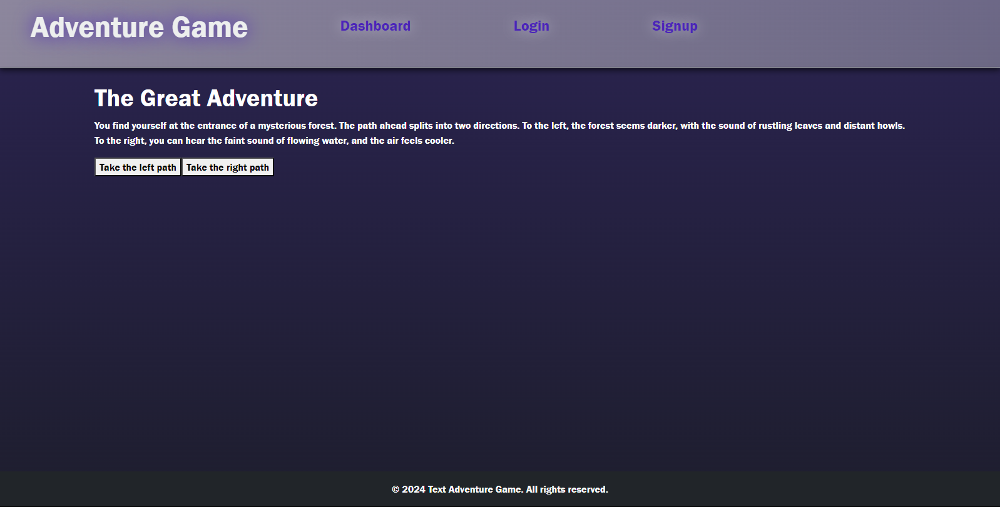
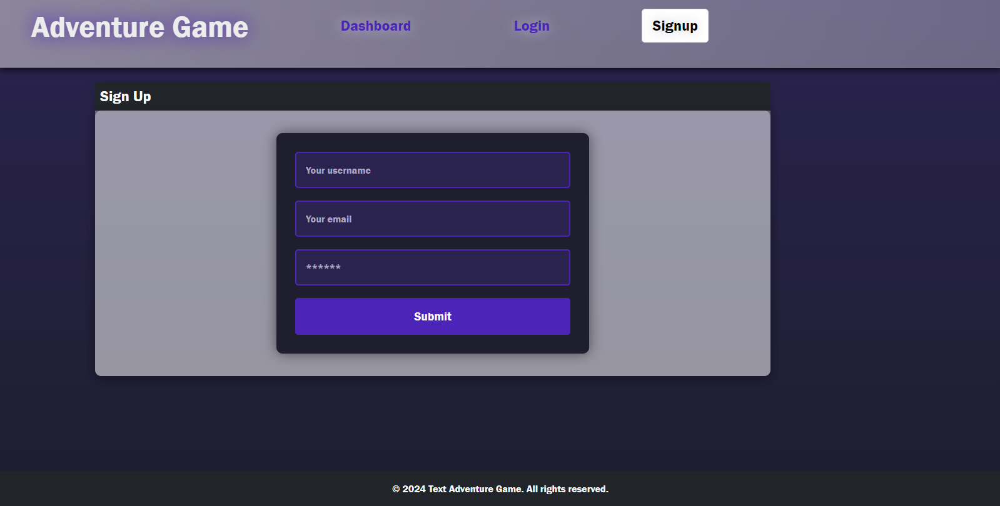
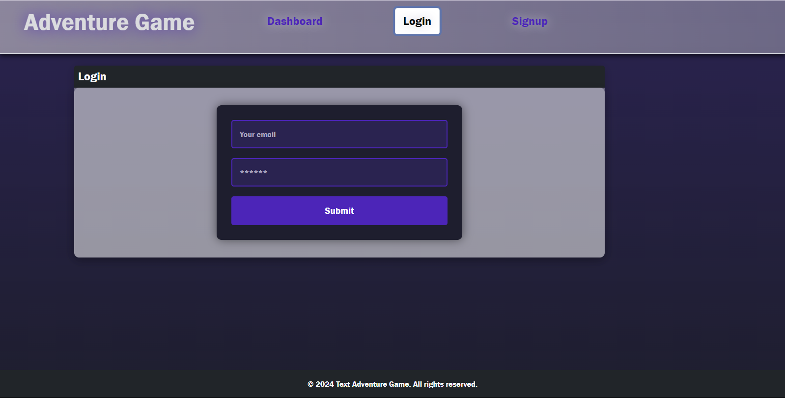

# Text-Based Adventure Game  

Link to Site: [Text-Based Adventure Game](https://text-based-adventure-game.onrender.com/)

## Description  
This is a single-page application built with the MERN stack, allowing users to sign up and log in to save their progress. On the dashboard, users can view a brief game description and start the game. The adventure unfolds through a series of prompts, each presenting two choices that guide the user through different narrative paths until an outcome is reached.

## Tech Stack  
- **Frontend**: React, JavaScript, Bootstrap  
- **Backend**: Node.js, Express  
- **Database**: MongoDB, Mongoose ODM  
- **API**: GraphQL (queries, mutations, type definitions, resolvers)  
- **Deployment**: Render  

## Table of Contents  
- [Description](#description)  
- [Tech Stack](#tech-stack)  
- [Process](#process)  
- [Access](#access)  
- [Usage](#usage)  
- [License](#license)  
- [Contributors](#contributors)  
- [Acknowledgements](#acknowledgements)  

---

## Process  
The project started by adapting a basic MERN stack activity from the Vanderbilt Bootcamp. The following modifications were made:  
- **User Model:** Updated to include username, email, and password for authentication.  
- **React Components:** `Main.jsx` and `App.jsx` were structured to feature four key pages—Dashboard, Login, Signup, and Game, accessible from the header.  
- **Game Logic:** The game starts from the Dashboard when the **Start Game** button is clicked. Each prompt presents two actions, leading to different narrative outcomes.  
- **GraphQL Implementation:** Updated front-end and back-end files to include custom queries, mutations, type definitions, and resolvers for managing game state and user data.  
- **UI Design:** Bootstrap was used for styling to enhance the user interface.  
- **Database Seeding:** Seed data was added to initialize the game content.

## Access  
Explore the game here: [Text-Based Adventure Game](https://text-based-adventure-game.onrender.com/).

## Usage  
This game is designed purely for entertainment. After logging in, users can start the game and choose between two actions per prompt. Each decision affects the path and outcome of the story.

## License  
This repository is licensed under the [MIT](https://opensource.org/licenses/MIT) license.

## Contributors  
- Jeremy Fleming  
- Logan New  
- Sean Crocker  
- David Waweru  
- Mackenzie Moore  

## Acknowledgements  
This project was built using knowledge and tools provided by the Vanderbilt Bootcamp.  

---

## Screenshots  
  
  
  
